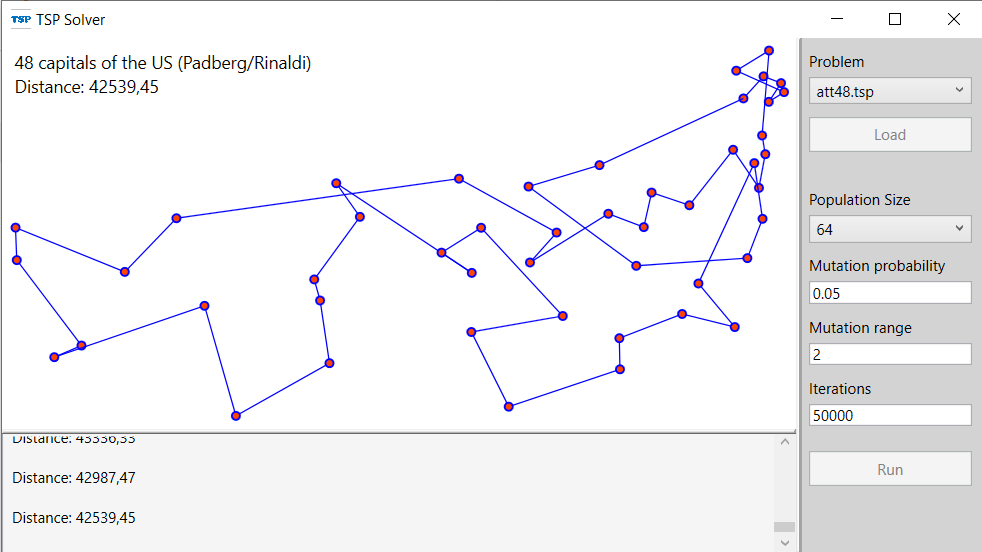

# traveling-salesman-problem
This porject implements a basic genetic algorithm to find good solutions for TSP problems. The UI displays the solution graph and provides functionality to load different problems and adjust the parameters of the calculation.

